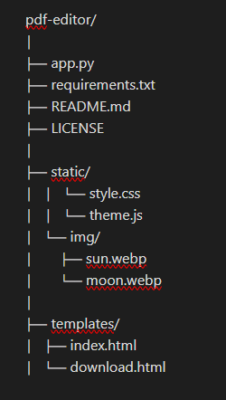

# PDF Editor

Este é um projeto web simples para edição de arquivos PDF. Ele permite:

- Adicionar senha a um PDF
- Remover senha de um PDF
- Converter arquivos de vários formatos para PDF

## 🔧 Tecnologias utilizadas

- Python 3
- Flask
- PyPDF2
- ReportLab
- HTML5 / CSS3 / JS
- Modo claro/escuro com ícones de tema 🌘☀

## 📦 Instalação

1. Clone o repositório:

git clone https://github.com/seu-usuario/pdf-editor.git
cd pdf-editor

2. Crie e ative um ambiente virtual:

python -m venv venv
source venv/bin/activate  # Linux/macOS
venv\Scripts\activate     # Windows

3. Instale as dependências:

pip install -r requirements.txt

4. Execute o servidor:

python app.py

5. Acesse em: http://localhost:5000

## 📂 Estrutura do Projeto

